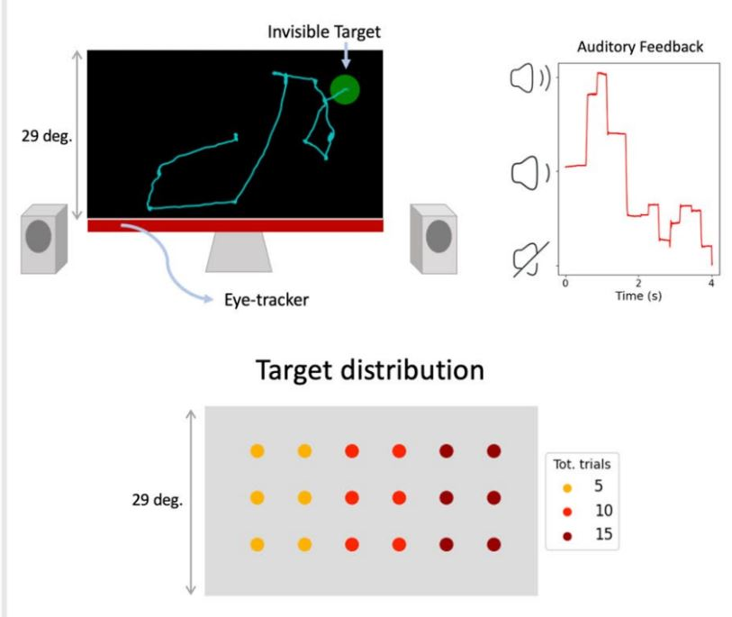

---
authors:
- admin
categories:
- stroke
- attentional load
- visuo-spatial attention
- FCnet
- dual task
- extinction
- unilateral spatial neglect
- machine learning
- predictive modelling
- multiple demands system
- spatial awareness
- eye movements
- statistical learning
- free viewing
- dimensionality reduction
- feature extraction
date: "2025-05-15T00:00:00Z"
draft: false
featured: false
image:
  caption: 'Graphical abstract, Blini et al., [2025](https://www.biorxiv.org/content/10.1101/2023.10.11.561866v1)'
  focal_point: ""
  placement: 2
  preview_only: false
lastmod: "2025-05-10T00:00:00Z"
projects: [FCnet]
tags:
- stroke
- attentional load
- visuo-spatial attention
- FCnet
- dual task
- extinction
- unilateral spatial neglect
- machine learning
- predictive modelling
- multiple demands system
- spatial awareness
- eye movements
- statistical learning
- free viewing
- dimensionality reduction
- feature extraction
show_comments: true
title: Two new articles!
subtitle: "Two important updates for the diagnosis and rehabilitation of visuo-spatial biases"
summary: "Blini et al. and Cinetto et al. report innovative methods for the diagnosis and rehabilitation of (subtle) spatial biases"  

---

Hello there! 

I am happy to share the publication of two papers!
Coincidentally, they have been accepted in the same week. Not as coincidentally, they have in common the interesting and practically important topic of spatial attentional biases.

The first paper, previously available as a preprint, has been thoroughly revised and is now published in *Communications Biology* [link](https://www.nature.com/articles/s42003-025-08074-z).

The background of this study is the observation that, due to advances in stroke management, the line separating relatively spared patients and patients with some degree of impairment is moving, all while becoming more blurred and uncertain. This is arguably paramount to better frame **diagnosis** and **rehabilitation** strategies. Thus, this article sets out to explore what marks the passage, after stroke, to clinically manifest symptoms, by using lateralized attentional disorders as an exemplary case.

We have tested a cohort of 46 chronic, first-ever **stroke** patients, selected for the absence, in standardized neuropsychological tests, of lateralized attentional disorders (i.e., spatial neglect). Patients were administered with a computerized task that exploited **multitasking** (i.e., attentional load) as a tool to disclose hidden deficits, if any, by stressing a domain-general, **Multiple Demand** system and thus the inherent information processing limits of the brain. We then used an unsupervised clustering algorithm to classify the multivariate pattern of their performance in one of two groups: confirmed-spared, or highly **susceptible to multitasking**. We show that the latter group indeed presents with stark lateralized deficits of attention, though limited to conditions of multitasking. The distinction unveiled by these data is not a mere theoretical detail: patients in the highly susceptible group presented higher scores, indicative of more difficulties, in the assessment of activities of daily living. 

We also used rotated Principal Component Analysis to extract a latent factor that provides an index of susceptibility to multitasking across the entire sample. This latent factor was then used to relate multitasking performance to brain lesions and structural disconnections using a multivariate approach. Notably, lesion volume was not a determinant of the susceptibility to multitasking, whereas lesions to frontal white matter extending into areas associated with the multiple demands network (i.e., frontal operculum and anterior insula) were found to predict the degree by which lateralized deficits arose during multitasking. The predictive structural disconnectome involved MD-related connectivity (i.e., anterior thalamic radiation) previous associated to multitasking in healthy subjects, as well as fronto-parietal connections known to be implicated in neglect (SLF II), thereby suggesting that white matter disconnections underlie the impaired interaction between domain-general mechanisms (MD) and domain-specific processing (i.e., visuo-spatial processing in PPC).

I've started working on this (and related) projects almost 12 years ago, when I first reached Padova for my Ph.D. The work has been massive and I really want to thank profusely all the coauthors for what is, I believe, a very complete and extensive work on this topic, and the one that finally allows us to clearly stress the importance of the take-home message. 

The mismatch between the amount of brain damage and the observed behavioral deficits has always been puzzling, and many constructs have been proposed to try to fill the gap (e.g., cognitive/brain reserve). With this paper, we firmly put forward the idea that the framework of multitasking provides the opportunity to study – with greater experimental control and in a finely-grained, parametric fashion – the instances in which compensation is no longer possible. 

Successful compensation for a deficit is a desirable feature, as it may indicate that sufficient cognitive resources can be recruited when needed to overcome everyday life challenges and difficulties. But this condition may be fragile, as for a substantial share of patients these resources may be limited and rigidly capped. Hence, assessing susceptibility to attentional load allows one to objectively quantify the extent by which these patients would struggle in more taxing conditions, thereby enhancing our understanding of their needs. We believe that this may by itself represent a novel, fresh take on a matter of long-lasting debate.

The full article is available at this link:
https://www.nature.com/articles/s42003-025-08074-z

Then, a second paper in on the way!

The work is led by Sebastiano Cinetto [Cinetto et al., 2025]()

Sebastiano has been working relentlessly on this fascinating topic since his undergraduate studies. The first piloting of what became this experiment, I remember, took place in Padova during a period of severe covid19-related restrictions. But Sebastiano managed to get the most out of it and his Ph.D., and even pre-registered the protocol for this study.

In the paper we uncover how hidden patterns in the environment steer our gaze beyond the task at hand.

In particular, we show that people can unconsciously learn hidden spatial patterns during a visual search—and that this **statistical learning** influences how they look around in more natural settings. Using a novel closed-loop setup, we asked participants to search for invisible targets using only real-time auditory feedback about their gaze distance. Without their knowledge, we biased target locations toward one side of the screen. Over time, participants’ search performance improved, especially in the biased direction. Importantly, this spatial bias carried over to subsequent free-viewing situations like free-viewing (resting) gaze and image exploration, though it did not affect spatial judgments. 

Our findings reveal that experience-driven learning during search can spill over into everyday viewing behavior, opening exciting new possibilities for interventions to correct pathological spatial biases.

So you can see very well how the two papers are deeply connected.

The article is scheduled to appear soon (I will update with the link). 

Stay tuned for further updates!!!

